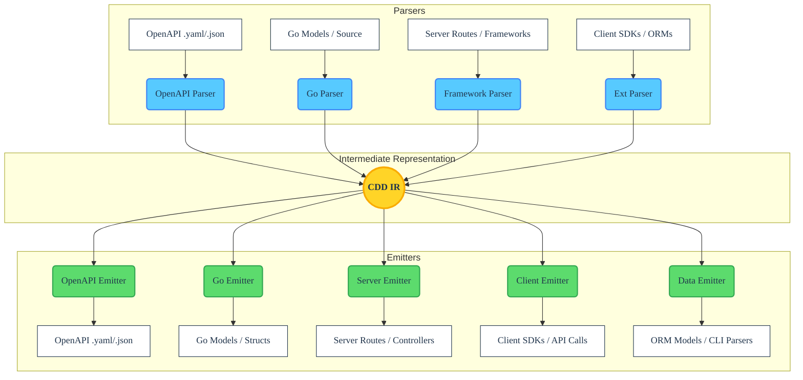

# cdd-go Architecture

<!-- BADGES_START -->

<!-- BADGES_END -->

The **cdd-go** tool acts as a dedicated compiler and transpiler. Its fundamental architecture follows standard compiler design principles, divided into three distinct phases: **Frontend (Parsing)**, **Intermediate Representation (IR)**, and **Backend (Emitting)**.

This decoupled design ensures that any format capable of being parsed into the IR can subsequently be emitted into any supported output format, whether that is a server-side route, a client-side SDK, a database ORM, or an OpenAPI specification.

## 🏗 High-Level Overview

## 🧩 Core Components

### 1. The Frontend (Parsers)

The Frontend's responsibility is to read an input source and translate it into the universal CDD Intermediate Representation (IR).

* **Static Analysis (AST-Driven)**: For `Go` source code, the tool **does not** use dynamic reflection or execute the code. Instead, it reads the source files, generates an Abstract Syntax Tree (using `github.com/dave/dst` to preserve formatting), and navigates the tree to extract classes, structs, functions, type signatures, API client definitions, server routes, and docstrings.
* **OpenAPI Parsing**: For OpenAPI inputs, the parser normalizes the structure using `encoding/json` and the standard `openapi` library into the IR.

### 2. Intermediate Representation (IR)

The Intermediate Representation is the crucial "glue" of the architecture. It is a normalized, language-agnostic data structure that represents concepts like:
* **Models**: Entities containing typed properties, required fields, defaults, and descriptions.
* **Endpoints / Operations**: HTTP verbs, paths, path/query/body parameters, and responses. In the IR, an operation is an abstract concept that can represent *either* a Server Route receiving a request *or* an API Client dispatching a request.
* **Metadata**: Tooling hints, docstrings, and validations.

By standardizing on a single IR, the system guarantees that parsing logic and emitting logic remain completely decoupled.

### 3. The Backend (Emitters)

The Backend's responsibility is to take the universal IR and generate valid target output.

* **Code Generation**: Emitters iterate over the IR and generate idiomatic `Go` source code. 
  * A **Server Emitter** creates routing controllers (`net/http`) and request-validation logic.
* **Specification Generation**: Emitters translating back to OpenAPI serialize the IR into standard OpenAPI 3.2.0 JSON, rigorously formatting descriptions, type constraints, and endpoint schemas based on what was parsed from the source code.

## 🔄 Extensibility

Because of the IR-centric design, adding support for a new `Go` framework requires minimal effort:
1. **To support parsing a new framework**: Write a parser that converts the framework's AST/DSL into the CDD IR. Once written, the framework can automatically be exported to OpenAPI, Client SDKs, CLI parsers, or any other existing output target.
2. **To support emitting a new framework**: Write an emitter that converts the CDD IR into the framework's DSL/AST. Once written, the framework can automatically be generated from OpenAPI or any other supported input.

## 🛡 Design Principles

1. **A Single Source of Truth**: Developers should be able to maintain their definitions in whichever format is most ergonomic for their team (OpenAPI files, Native Code) and generate the rest.
2. **Zero-Execution Parsing**: Ensure security and resilience by strictly statically analyzing inputs. The compiler must never need to run the target code to understand its structure.
3. **Lossless Conversion**: Maximize the retention of metadata (e.g., type annotations, docstrings, default values, validators) during the transition `Source -> IR -> Target`. This is largely achieved by employing the `dst` library to maintain comments and whitespace integrity throughout transformations.
4. **Symmetric Operations**: An Endpoint in the IR holds all the information necessary to generate both the Server-side controller that fulfills it, and the Client-side SDK method that calls it.